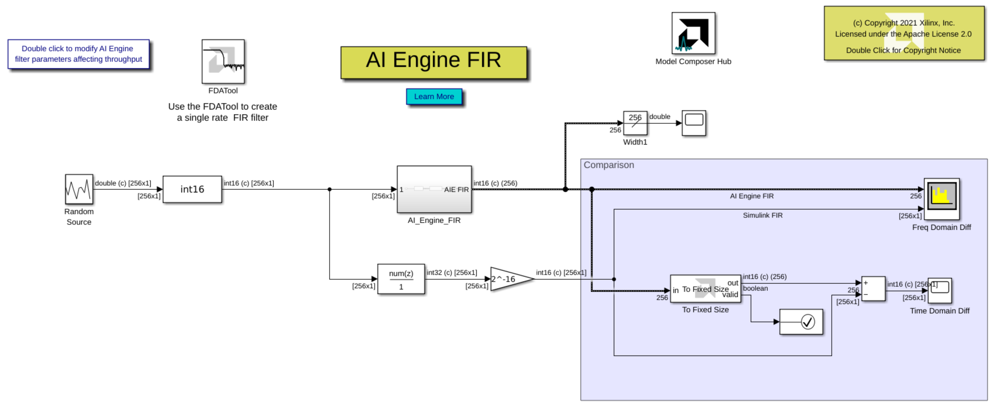
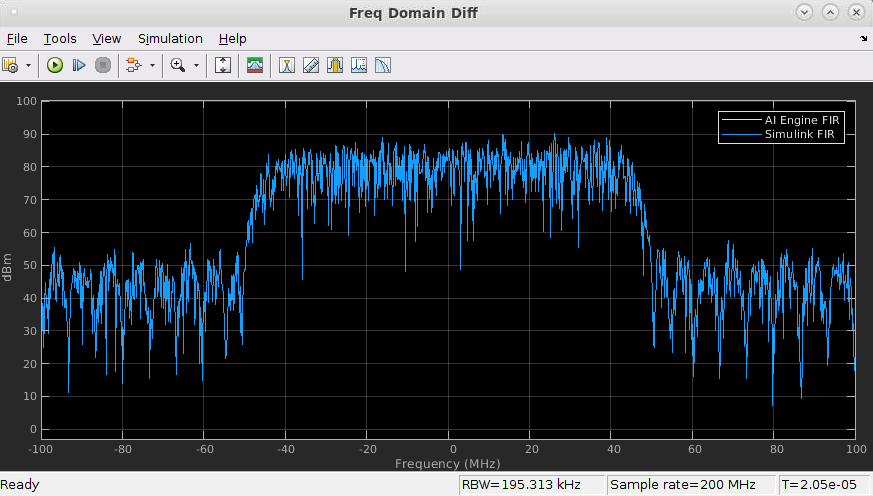

# Using DSPLib AI Engine FIR directly from the library browser

This example demonstrates using the AI Engine 'FIR Asymmetric Filter' block in Model Composer and comparing the results to the Simulink FIR block.

## Knowledge nuggets about throughput
:bulb: To estimate the throughput for this design, you should run the AI Engine System C simulator.

:bulb: The FIR Asymmetric block has two parameters to tweak to adjust the throughput. The _Input Window Size_ and the _Number of Cascade Stages_. The number of AI Engine tiles used in the implementation is equal to the _Number of Cascade Stages_. The table below gives you an idea of how the throughput changes for this design as you change these parameters:

| Input Window Size | Cascade Length | Throughput |
|-------------------|----------------|------------|
|256|1|296 Msps|
|256|4|674 Msps|
|512|4|799 Msps|
|1024|4|898 Msps|

:bulb: The larger the _Input_Window_Size_ the larger is the latency of the filter.

## Knowledge nuggets about setting up the design

:bulb: Note that the Spectrum Analyzer block accepts a Variable Size Signal as input. Likewise, Simulink *Scope* block and *Display* block also accept variable size signals as inputs. 

:bulb: In this example, the output variable size signal is always full, i.e. the number of samples in the signal is equal to the maximum size of the variable size signal (in this case 256). We can monitor this using Simulink *width* block and a scope. Note that the number shown on the *width* block is the maximum size of the input signal while the output of the block is the number of samples in the variable size signal. 

:warning: If the number of samples in the variable size signal is not equal to the maximum number of samples of the variable size signal, directly attaching the variable size signal to the spectrum analyzer will result in a misleading output (zeros will be inserted to fill the missing samples). For cases where the variable size signal is not full, use the *Variable Size Signal to Workspace* block to move the data to the workspace and then post process the data. 

:bulb: Note how you can design the filter using the *Filter Design and Analysis tool* and directly pass the resulting taps to the AI Engine 'FIR Asymmetric Filter' block. 

The image below depicts the output of DSPlib AI Engine FIR in comparison with the Simulink FIR block.

------------
Copyright 2020 Xilinx

Licensed under the Apache License, Version 2.0 (the "License");
you may not use this file except in compliance with the License.
You may obtain a copy of the License at

    http://www.apache.org/licenses/LICENSE-2.0

Unless required by applicable law or agreed to in writing, software
distributed under the License is distributed on an "AS IS" BASIS,
WITHOUT WARRANTIES OR CONDITIONS OF ANY KIND, either express or implied.
See the License for the specific language governing permissions and
limitations under the License.
