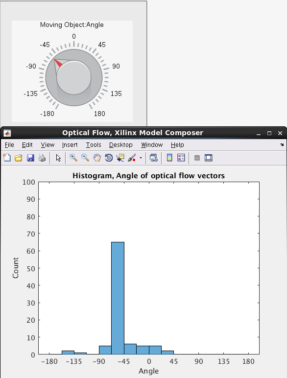
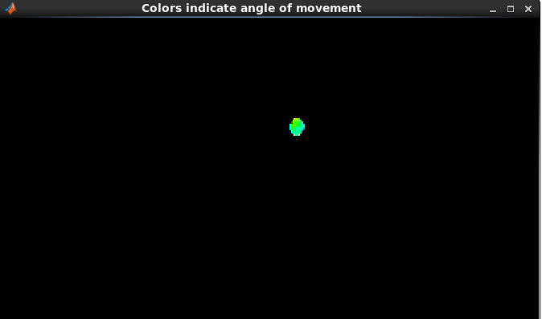

# Optical flow
This example demonstrates an implementation of dense optical flow in Model Composer.

This example uses the following Mathworks toolboxes.  
* [MATLAB Computer Vision System Toolbox](https://www.mathworks.com/products/computer-vision.html)  
* [DSP System Toolbox](https://www.mathworks.com/products/dsp-system.html)

## What is dense optical flow?

Optical flow is the apparent motion of objects between two consecutive frames caused by the movement of objects or camera. This example demonstrates the Luckas-Kanade (LK) optical flow algorithm using Model Composer. The algorithm is based on two assumptions:

* Object pixel intensities do not change between consecutive frames.
* Neighboring pixels have similar motion.

## Input sources to this example

This example provides two input sources, "Moving Objects" and "Moving People". To switch between the two sources, double click on the manual switch block.

## Moving Objects

This source is a ball shaped object moving across the screen. You can set the angle of the movement using the dial.

The reason behind having this source is to get a quantitative analysis of the result of the optical flow algorithm. The dense optical flow calculates a flow vector for every pixel in the image. Each vector has a magnitude and an angle. For each frame, we plot the histogram of the angles of each vector with a non-zero magnitude. As you turn the dial, you would see the angle of the vectors change.

The other view into the results is a color coded output video. This is an HSV (Hue, Saturation, Lightness) representation of the image. The angle of the vectors are represented by the Hue of the pixel. As you turn the knob, you see that the the direction of the object changes but also the color of the object.

## Moving people

This is a real life situation video of two people moving in a scene. For this input source, the histogram is no longer a good view into the results and as such we close the histogram.

------------
Copyright 2020 Xilinx

Licensed under the Apache License, Version 2.0 (the "License");
you may not use this file except in compliance with the License.
You may obtain a copy of the License at

    http://www.apache.org/licenses/LICENSE-2.0

Unless required by applicable law or agreed to in writing, software
distributed under the License is distributed on an "AS IS" BASIS,
WITHOUT WARRANTIES OR CONDITIONS OF ANY KIND, either express or implied.
See the License for the specific language governing permissions and
limitations under the License.
