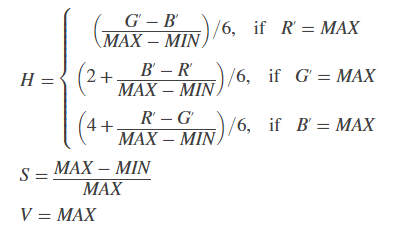
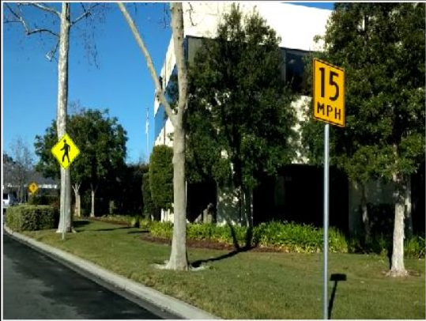
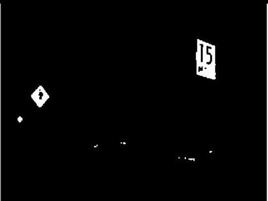

# Color Detection
This example demonstrates color detection on an input video.

This example uses the following Mathworks toolboxes.  
* [MATLAB Computer Vision System Toolbox](https://www.mathworks.com/products/computer-vision.html)  
* [DSP System Toolbox](https://www.mathworks.com/products/dsp-system.html)

Color detection is used for object tracking and object detection based on the color of the object. The color based methods are useful for object detection and segmentation when the object and the background have a significant difference in color.

The Color detection algorithm in this example is comprised of the following subsystems:

* RGB to HSV conversion
* Color thresholding
* Morphological operation

In this example, we feed a video taken from a car's front facing camera to the algorithm and segment the yellow traffic signs.

## RGB to HSV Conversion

The input video is in RGB color space. We first convert the video from RGB to HSV color spaces. HSV color space is the most suitable color space for color based image segmentation. The conversion formula from RGB to HSV color spaces can be done using the following formulas:

Where MAX = max(R',G',B'), MIN = min(R',G',B'), and R',G', and B' are normalized to [0 1] range.

We use the C/C++ import functionality of Model Composer to import the RGB2HSV function as a block into the design. This algorithm is well optimized in terms of timing and resources. The function signature of the RGB2HSV function is:

       template<int SRC_T, int ROWS, int COLS,int NPC=1> void
       RGB2HSV(xf::Mat<SRC_T, ROWS, COLS, NPC> &_src_mat,
       xf::Mat<SRC_T, ROWS, COLS, NPC> & _dst_mat)

xf::Mat is a template class that serves as a container for storing image data and its attributes. To port RGB2HSV into Model Composer, we need to write a wrapper function that converts a 2d array to xf::Mat and vice versa. This is done in RGB2HSV_wrap.h file where the RGB channels are converted to an xf::Mat object and the resulting xf::Mat object from the function is then converted into three HSV channels. To gain a deeper understanding of how this is done, please review the contents of RGB2HSV_wrap.h.

## Color Threshold

Based on the H (hue), S (saturation) and V (value) values, we apply the thresholding operation to the HSV image and return either 0 or 255. H,S,V threshold values should be specified in the range of 0-255. The example below demonstrates the threshold values for yellow color detection.

## Morphological operation

Morphological operations apply a structuring element to an image, creating an output image of the same size. This reduces unnecessary white patches in the image. The most basic morphological operations are dilation and erosion.

* Dilation – Enlarges the boundaries of regions of foreground pixels.
* Erosion - Erodes/shrinks the boundaries of regions of foreground pixels(i.e. white pixels, typically).
* Morphological opening – It consists of Erosion followed by Dilation. The effect of this operation is the structured removal of image region boundary pixels
* Morphological closing – It consists of Dilation followed by Erosion. The effect of this operation is structured filling in the image region boundary pixels.

*Note*: For Color Threshold and Morphological operations also, we use C/C++ import functionality of Model composer.

## Sample input and output frames

The images below shows an input frame and output frame to the algorithm.

------------
Copyright 2020 Xilinx

Licensed under the Apache License, Version 2.0 (the "License");
you may not use this file except in compliance with the License.
You may obtain a copy of the License at

    http://www.apache.org/licenses/LICENSE-2.0

Unless required by applicable law or agreed to in writing, software
distributed under the License is distributed on an "AS IS" BASIS,
WITHOUT WARRANTIES OR CONDITIONS OF ANY KIND, either express or implied.
See the License for the specific language governing permissions and
limitations under the License.
