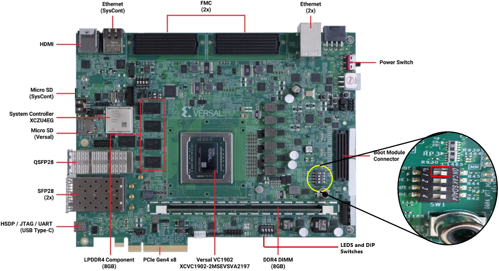
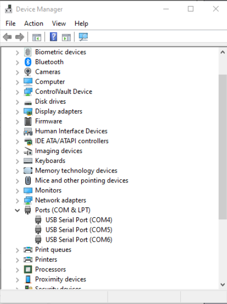
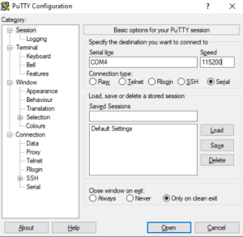

# How to run BOOT.BIN on Hardware
Hardware validation flow in Vitis Model Composer provides a methodology to verify AI Engine based applications on Hardware. It also provides the option to generate a hardware image (BOOT.BIN), targeting a
specific platform. This hardware image can then be run on a board to verify whether the results from hardware match with the simulation outputs.

This quick guide explains how to manage the board settings, make cable connections, connect the board through your system, and program the BOOT.BIN on a VCK190 Versal board.

> Here we are assuming the board is physically connected to a Wondows machine but generating the BOOT.BIN using Vitis Model Composer is done on a Linux machine.

1. Connect the power cable to the board.
2. Connect a USB Micro cable between the host machine and USB JTAG connector on the target board. This cable is used for USB to serial transfer.
3. Ensure that the SW1 switch is set to the JTAG boot mode and power on the VCK190 board using the power switch as shown in the following figure.

   

Once your board is set up, program the device as follows:

4. In Windows 10, click the search box on the taskbar and type Device Manager , then select from the Menu.
5. When the board is powered ON and connected to your machine through the USB interface, determine the COM ports that are between the VCK190 board and your computer from Windows Device Manager.

   

6. Use a Terminal application (Teraterm or Putty) to open up COM port interfaces on these ports (COM4, COM5 and COM6 in the above case at 115200 baud rate).

   

   Note: Ensure the Connection type is set to Serial.

7. Run Hardware Server on Windows. (Learn how to install Hardware Server here)

   
   
8. Setup the board with XSDB and create a target connection to the host running the hw_server. 
   a. In Linux environment, open a new terminal and launch XSDB using the ```xsdb``` file from the Vitis installation directory as shown.

      ```
      <Xilinx Install Directory>/Vitis/<Version>/bin/xsdb
      ```
    b. From the XSDB prompt, run the following commands:
    
      ```
       connect -url <Hostname>:<Port_num>
       ta
      ```
      Note : You should use the hostname and port number as highlighted in step-7. Do not prepend the hostname with 'TCP:'.
       
    c. From within the XSDB prompt, navigate to the directory where hardware device image has been generated. In general, it is in ```<code-generation-directory>/run_hw/ src_ps/BOOT.BIN ```.
    
      ```
       cd <code-generation-directory>/run_hw/src_ps/BOOT.BIN
      ```       
9. Program the device and run:

   a. From the XSDB prompt, run the following command:
      ```
      device program BOOT.BIN
      ```
      You will see following message in the XSDB prompt if the device program is successful.
    
      

    b. This will run the design on the board and you should see the log similar to the following. Here, the hardware results are compared with the golden results.
    
    ```
       ******************************** Test Results ********************************
       ****** Model Composer and Hardware outputs match for all 40944 samples for output signal Out1 *******
       ****** Test passed ********
    ```
       
    c. To re-run the results, run following commands:
    
    ```
        rst -system
        device program BOOT.BIN
    ```

--------------
Copyright 2020 Xilinx

Licensed under the Apache License, Version 2.0 (the "License");
you may not use this file except in compliance with the License.
You may obtain a copy of the License at

    http://www.apache.org/licenses/LICENSE-2.0

Unless required by applicable law or agreed to in writing, software
distributed under the License is distributed on an "AS IS" BASIS,
WITHOUT WARRANTIES OR CONDITIONS OF ANY KIND, either express or implied.
See the License for the specific language governing permissions and
limitations under the License.
