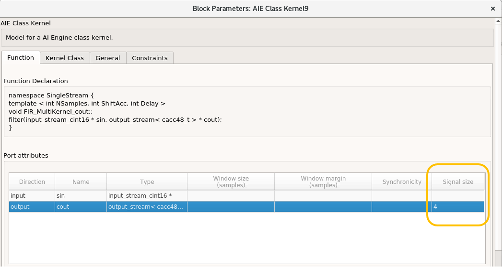
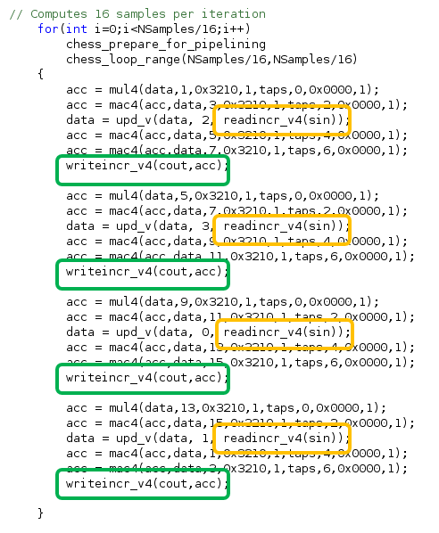

# How to properly set the Signal Size property on AI Engine kernel blocks with stream or cascade output?

This short tutorial goes over how to optimally set the signal size for AI Engine kernels with stream input and output. 

# What is "Signal Size"?

Signal Size is a block mask property associated with each stream or cascade output of an imported AI Engine block. This property is used only in Simulink simulation and is not reflected in the generated code. This value is always set as samples and not bytes. Here is an example of the block mask for a kernel with a stream output.

In the example above, the stream output of this block will be a [variable-size signal](../Variable_Size_Signals/README.md) with a maximum size of 4 samples as shown below:

# How to set "Signal Size"?

# Example 1
Here is an example of a kernel function we are importing into Vitis Model Composer:

  
And below is a screenshot of a design including this kernel:

The input signal size to the block is 128 samples. As such, at each invocation of the block, the kernel will consume all 128 samples (128 calls to _readincr_) and produce 256 samples (256 calls to _writeincr_). 

If we set the _Signal Size_ parameter for the output to a number smaller than 256 (say 128 as shown below) and run the simulation long enough, eventually the internal buffer for the output port will fill up. The reason is that at each invocation of the kernel, the kernel will produce 256 samples, but only 128 samples will be consumed by Simulink. The remaining samples will be stored in the kernel's internal buffer for its output port. 

Once the internal buffer for the output port fills up, the kernel can no longer write to it and will block at one of the _writeincr_ function calls. However, input samples will continue arriving to the kernel. Since the kernel is stalled, eventually its internal buffer for the input port will also fill up and the simulation will stop with an error indicating the input buffer is full. 

# Example 2
Let's look at the following kernel function we are importing:

In each iteration of the for loop, this kernel consumes 16 samples (each readincr_v4 reads four samples) and produces 16 samples (each writeincr_v4 writes four samples). Assume NSamples is equal to 16 for now.

## Feeding four samples at a time to the block

### Setting the "Signal Size" property to 4
If in Simulnk you feed a signal of size four to this block, upon invocation of the block, the block produces four samples and the AI Engine kernel stalls on the second "readincr_v4" until the block gets invoked with another four samples. In this case, you would normally set the output sample size to 4 so that upon execution of the first writeincr_v4, the block produces a variable-size signal of maximum size four that will carry four samples at all times. In this case the variable-size signal is full.

### Setting the "Signal Size" property to larger than 4
If you set the signal size to a value larger than 4, for example 8, the output will be a variable size signal with maximum size of 8 samples that carries only 4 samples. While numerically these values will be the same as when you set the signal size to 4, displaying the signal say on a scope will not be ideal as the scope will plot the four samples and leave empty spaces for the other void samples. 

### Setting the "Signal Size" property to smaller than 4
If you set the signal size to a number smaller than 4, say 2, upon execution of the first writeincr_v4, the kernel will still produce 4 samples. 
However, two will be saved in an internal buffer to the block and only two will be presented in the output signal. 
In this case, if the simulation runs for long enough time, eventually the internal buffer will fill up and the simulation will stop.

## Feeding more than 4 samples at a time to the block
While you can feed four samples and produce four samples for the example above, it is best if you feed the block with at least 16 samples or multiples of 16 samples. 
This will reduce the overhead of calling the block many times and will increase the simulation speed. 
For example if you feed the kernel with 16 samples, you would want to set the output signal size to 16 to both have a full variable-size signal 
(in case you want to view the signal on a scope) and avoid memory overflows.

# Conclusions
:bulb: Inspect the AI Engine kernel code to decide on the size of the "Signal Size" property.

:bulb: If possible avoid having a variable-size signal that is not full.

:bulb: If you set the "Signal Size" parameter to smaller than what it should be, you may encounter buffer overflow. 

